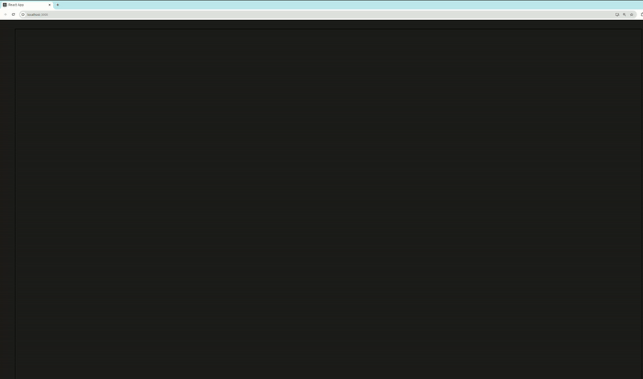

# DelaunayMesh

Incremental Delaunay triangulation in C++23.



## Performance
A complete refactor of the core triangulation code imporved performance **253x**.

| Points | Before | After | Speedup |
|--------|--------|-------|---------|
| 100,000 | 210s | 0.8s | 253x |
| 200,000 | ~840s | 2.3s | ~365x |

Throughput: **87,000 points/sec**

## Build

```bash
cd core
cmake -B build -DCMAKE_BUILD_TYPE=Release
cmake --build build
```

Requires:
- CMake 4.2+
- C++23 
- Boost (for WebSocket server)
- Google Test (for unit tests)

## Usage

```cpp
#include "mesh.h"

Mesh mesh;

// Add points one at a time
mesh.triangulatePoint(1.0, 2.0);
mesh.triangulatePoint(3.0, 4.0);
mesh.triangulatePoint(2.0, 5.0);

// Access results
for (const Triangle& tri : mesh.triangles()) {
    std::cout << "Triangle " << tri.index() << ": ";
    tri.printPoints();
}
```

## WebSocket Server

The project includes a WebSocket server for interactive visualization:

```bash
./build/ShapeTriangulation
# Listens on port 9002
```

Send JSON messages:
```json
{"action": "add_point", "data": {"x": 10.5, "y": 20.3}}
```

## Algorithm

Bowyer-Watson incremental insertion

When a point is inserted:
1. Locate containing triangle via walking search — O(√n) average
2. Split triangle into 3 (or 4 if on edge)
3. Restore Delaunay property by flipping edges — O(1) amortized

Total complexity: O(n log n) average case.

## Project Structure

```
core/
├── include/
│   ├── mesh.h        # Mesh class 
│   ├── triangle.h    # Triangle class
│   ├── point.h       # 2D point
│   └── constants.h   # helper constants
├── src/
│   ├── main.cpp      # WebSocket server
│   ├── mesh.cpp      # Triangulation implementation
│   ├── triangle.cpp  # Triangular geometry functions
│   └── point.cpp
└── test/
    ├── mesh_test.cpp        # unit test for functional correctness
    └── mesh_benchmark.cpp   # stress test of 100 000 points 
```

## Running Tests

```bash
cd core/build
./mesh_test        # Unit tests
./benchmark        # Performance benchmark
```

## Limitations

- 2D only
- Single-threaded

## Why I Built This

Learning project to understand:
- Computational geometry algorithms
- Modern C++ (C++23 features, performance optimization)